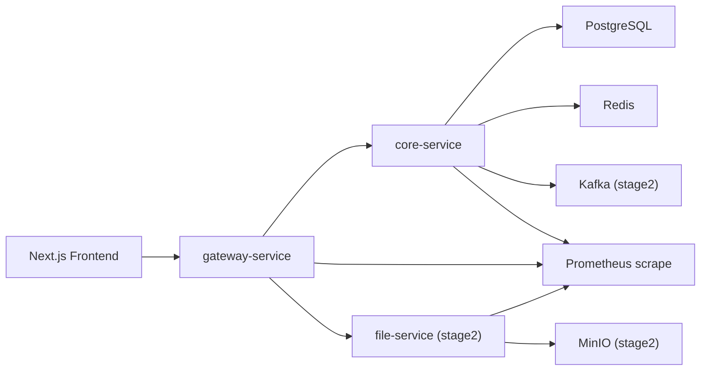

# SCMS+ Backend Architecture (Lightweight)

## Stage Mapping

- Stage 1: `gateway + core + postgres + redis`
- Stage 2: add `file + minio + kafka`
- Stage 3: add `prometheus + grafana + helm/k8s manifests`
