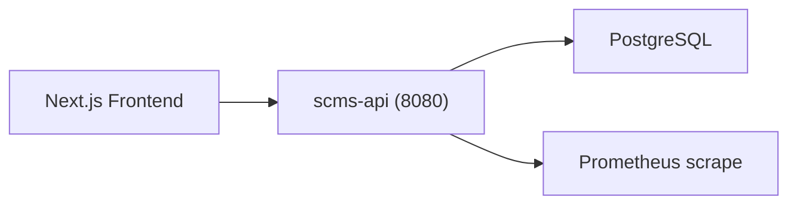

# SCMS+ Backend Architecture (Lightweight)

## Deployment

- 单体 `scms-api`：鉴权（JWT）、全部业务域、横切能力（审计/通知/事件）内置在一个 Spring Boot 进程，端口 `8080`
- 容器编排：docker compose 3 服务（`postgres` + `api` + `web`），见 `docker-compose.prod.yml`
- 观测：`prometheus + grafana`（`docker-compose.observability.yml`），指标端点 `/actuator/prometheus`

> 原微服务架构中的 `gateway-service`（纯路由冗余）、`file-service`（死代码）、Redis、Kafka 已在单体化重构中移除；JWT 鉴权由应用内 `JwtAuthenticationFilter` 承担，refresh token 存内存（`InMemoryTokenStore`），CORS 由 `SecurityConfig` 提供。
